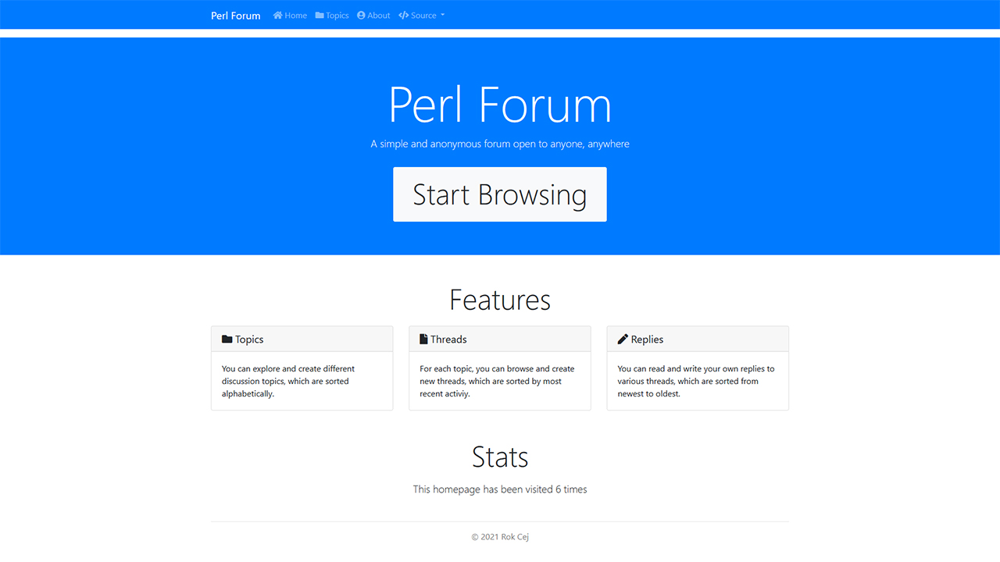
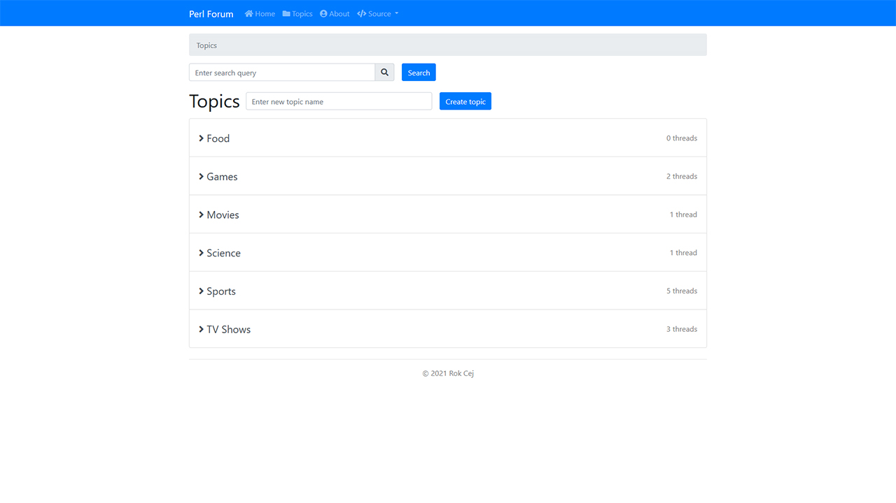
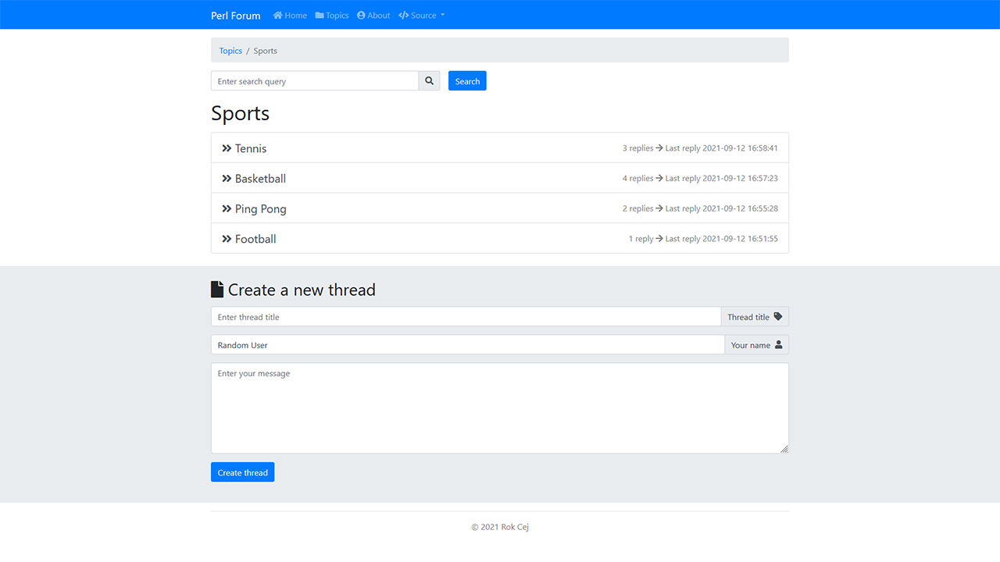
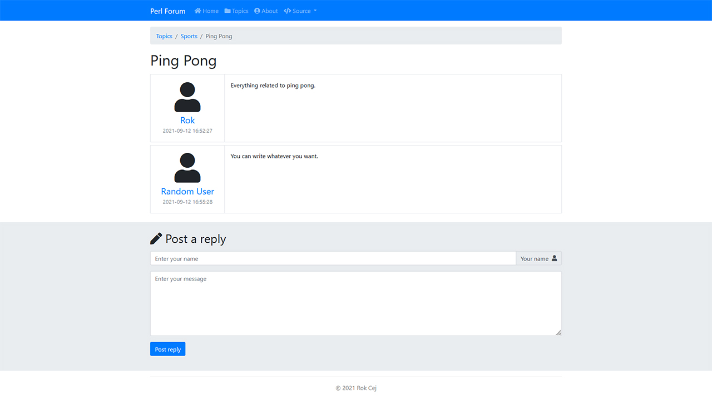

# Perl Forum

A web forum made in [Perl](https://www.perl.org/) using the CGI module.
The UI was designed with [Bootstrap](https://getbootstrap.com/) and icons from [Fontawesome](https://fontawesome.com/).


## Usage

Set up an HTTP server like [Apache](https://www.apache.org/) and make sure Perl is used to run `.cgi` files. To start using the forum, open `index.cgi`.

Things to watch out for:
* Fix the shebang in each `.cgi` file so that it points to the Perl installation location on your system.
	```perl
	#!C:\Perl64\bin\perl.exe -w
	```
* Make sure that the server has sufficient permissions, as it creates new folders and files, all located in the `data/` directory, which is also automatically created.


## Preview

* Index - homepage with a visit counter

* Topics - users can browse or create new topics to discuss

* Threads - users can browse or create new threads for each topic

* Replies - users can reply to each thread


